# Train TJBot to be a DJBot in Node-RED

In this tutorial, you'll connect TJBot to Spotify and have TJBot become a DJ, well, a DJBot! Please refer to [this blog post](https://medium.com/@jeancarlbisson/train-tjbot-to-be-a-djbot-in-node-red-6b80d0552ea6) for more information.

There are four components to this project. Node-RED running in the IBM Cloud, Node-RED running on the Raspberry Pi, the Spotify API, and the Watson IoT Platform service.

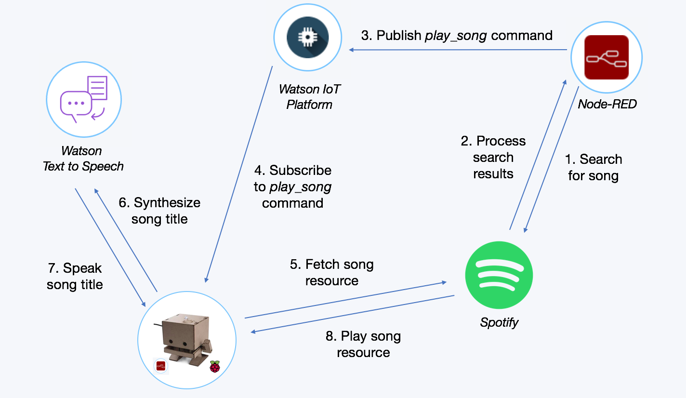

## Node-RED in IBM Cloud

Much of the logic happens in Node-RED running in the cloud, which interfaces with the Spotify API and Watson IoT Platform service. 

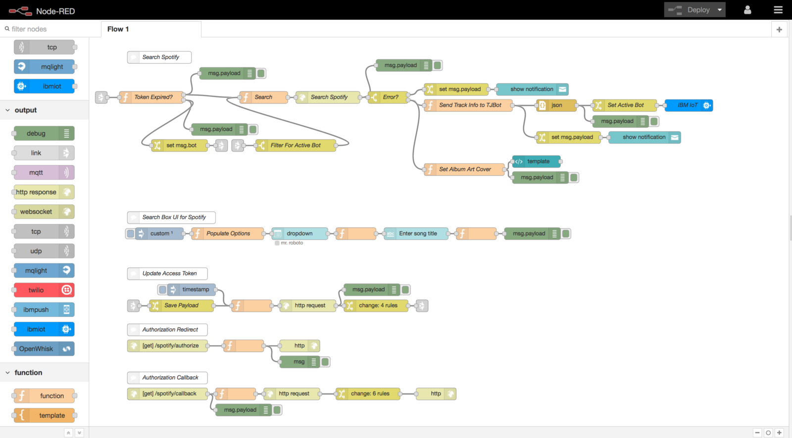

Create an **Internet of Things Platform Starter** application available in the IBM Cloud catalog. This creates a Node-RED application, an Internet of Things Platform service and runs the front-end interface for the DJBot.

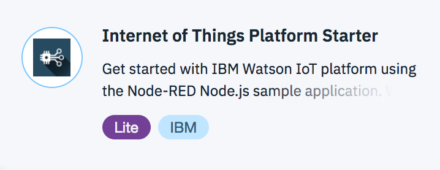

The front-end interface is created using the Node-RED dashboard nodes. Install the nodes by clicking the menu in the top right -> **Manage Palette** -> **Install** and search for *node-red-dashboard*. Click **install**.

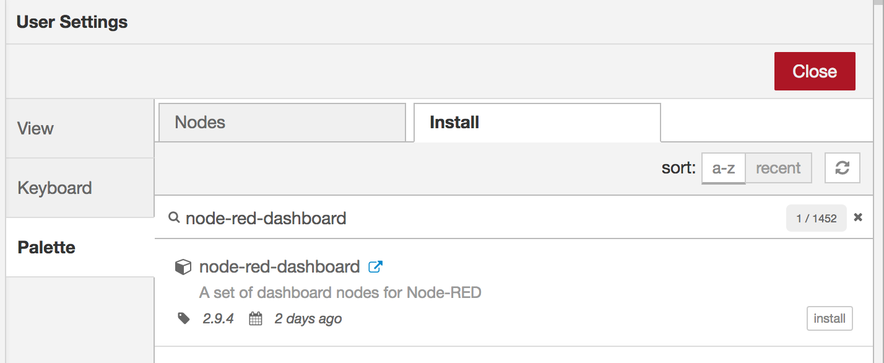

In the Watson Internet of Things Platform service, I registered a device type of `tjbot`. Each of my TJBots has a unique ID. In this tutorial, I assigned it `djbot`. 

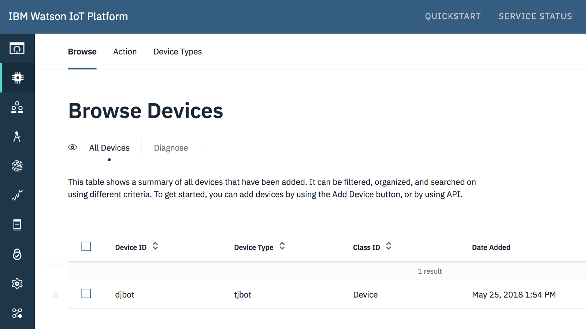

[Import this JSON](assets/cloudflow.json) into Node-RED. Edit the *ibmiot* node and use the device type and device ID. When a song is requested and located, an IoT command is sent to the TJBot.

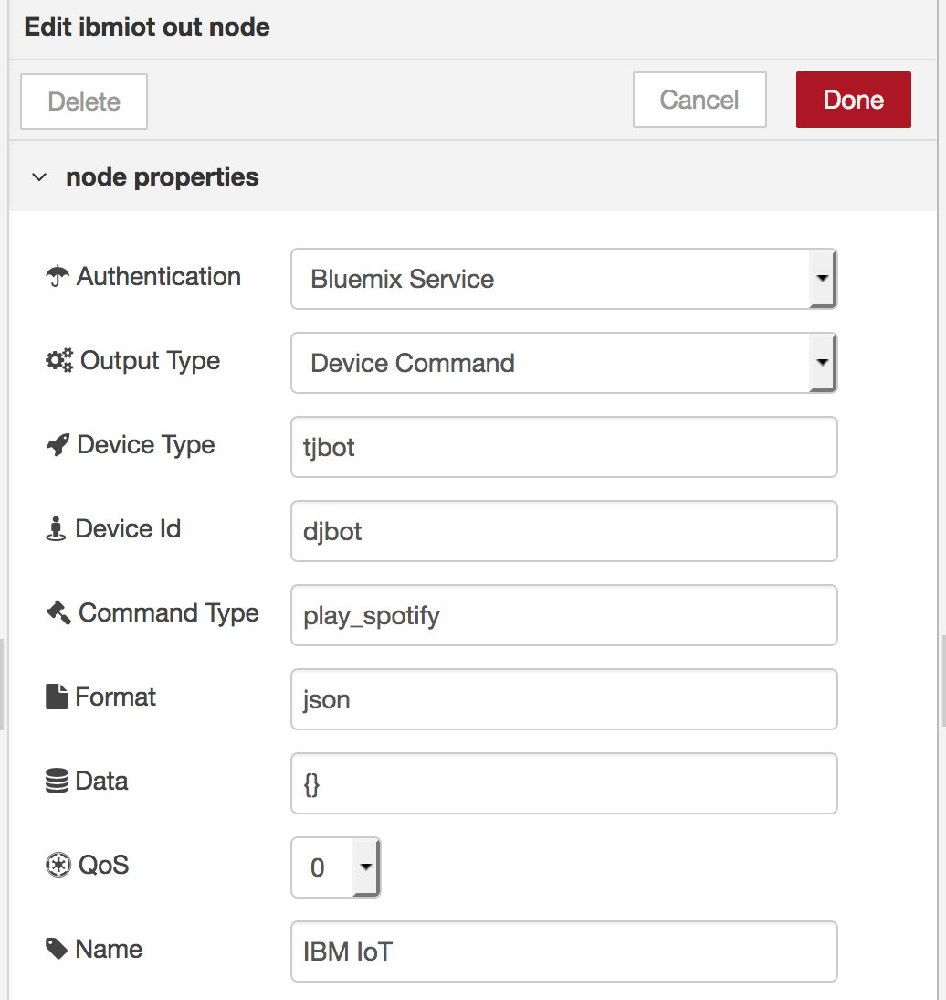

The command consists of a title of the song and a URL of the music to play.

```
{
    "title":"Mr. Roboto",
    "artist":"The Protomen",
    "url":"https://p.scdn.co/mp3-preview/974dcaf06dc9363740cb8cda51a90293471870df?cid= 12d34aa5e67890fab12eac3bf4567ac8"
}
```
 
Before you can call the Spotify API, you'll need to get a Client ID and Client Secret. [Sign up here](https://beta.developer.spotify.com/documentation/web-api).

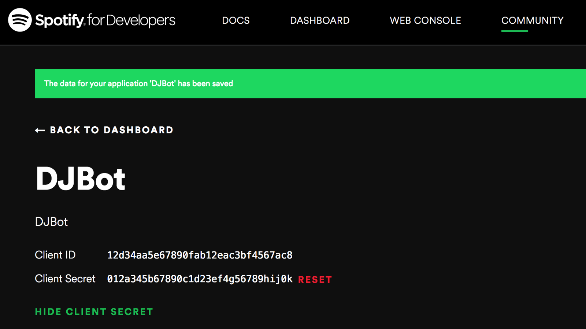

In the settings, add the redirect URI to point to the Node-RED application's endpoint `/spotify/callback`.

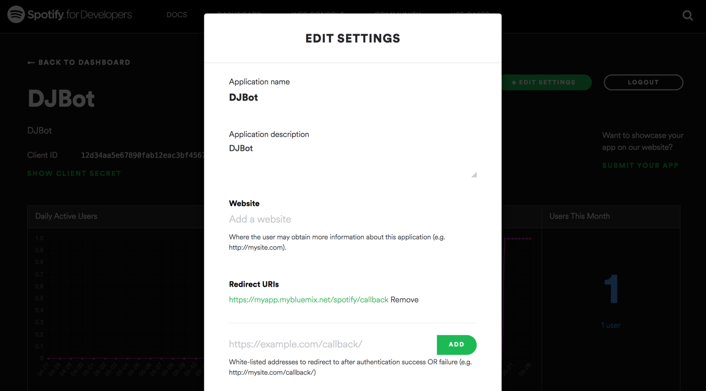

In Node-RED, edit the **Set Configuration** node with the Client ID, Client Secret, and the URLs for the callback and Node-RED Dashboard UI. The `spotifyCallback` URL is called after the user authorizes the application with Spotify. The `uiURL` should be the Node-RED dashboard URL, which is redirected to after the authorization is successful.

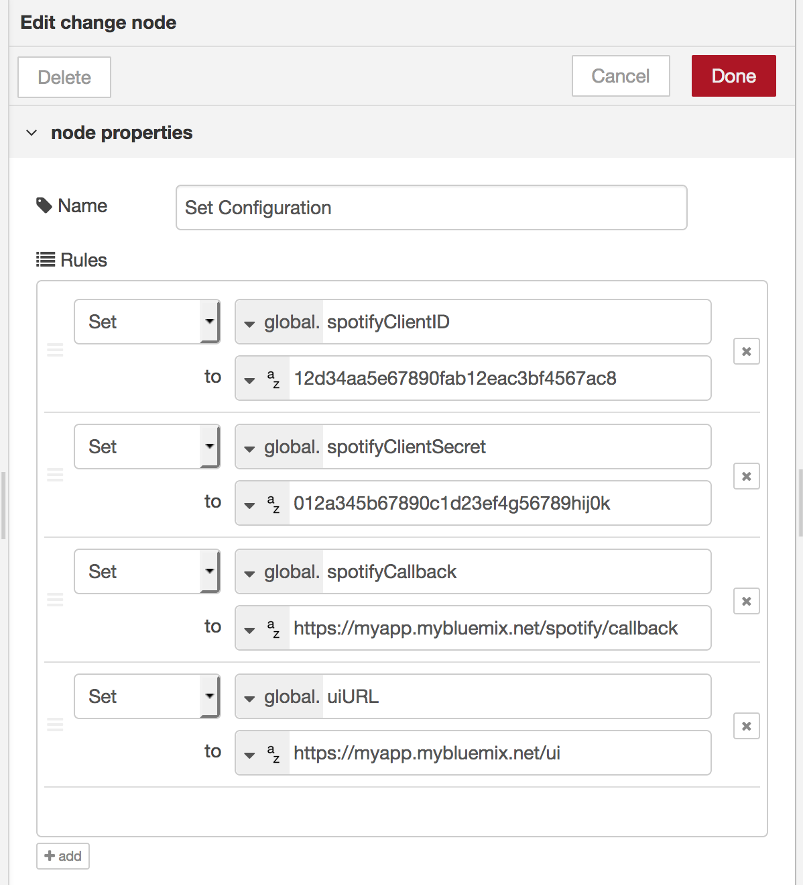

## Node-RED on Raspberry Pi

Keeping things in same language, I chose to use Node-RED on the Raspberry Pi running the TJBot. However, you can choose to subscribe to the IoT command in Python, Node.js, or another language and play the song that way.

If you haven't installed the TJBot Node-RED nodes on the TJBot, please refer to this [blog post for instructions](http://ibm.biz/train-tjbot-series) on how to do so. Import the [JSON flow](assets/tjbotflow.json). Here's what the Node-RED flow looks like.

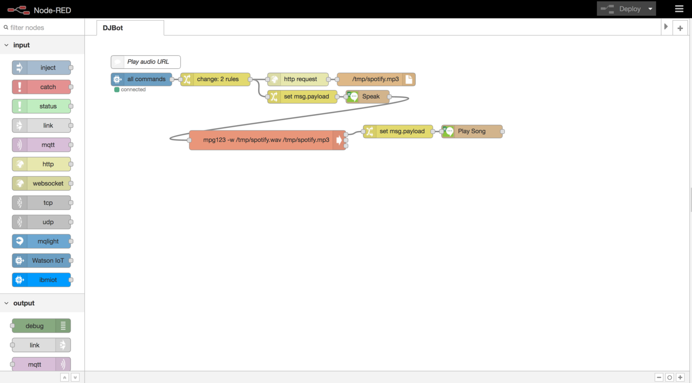

Double click on the Watson IoT input node and specify the IoT credentials for the TJBot to subscribe to the commands.

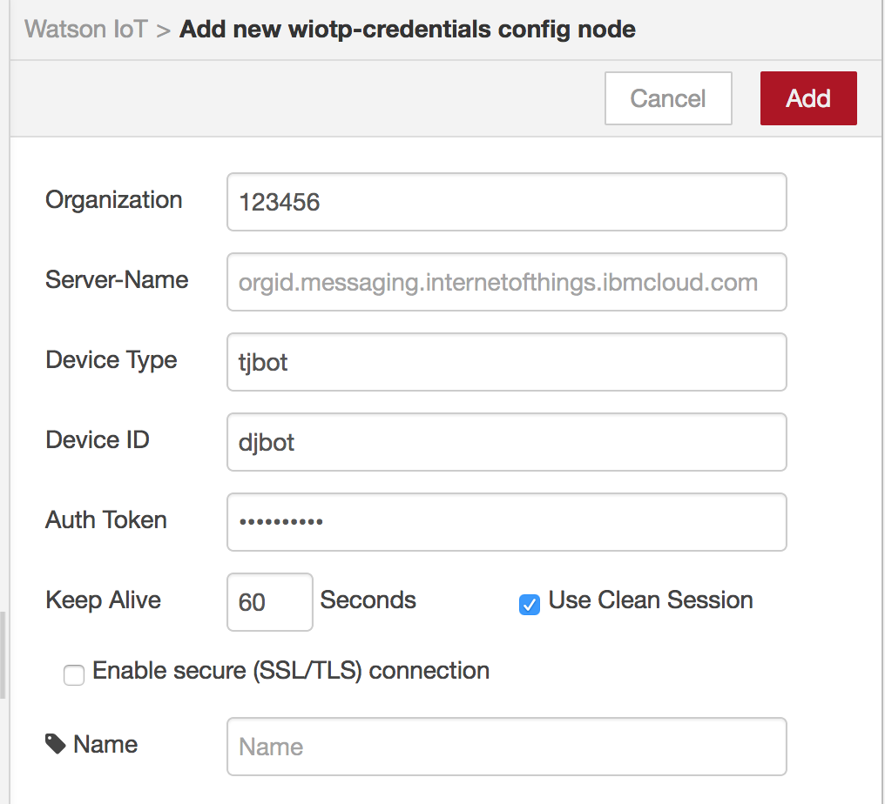

Double click on the speak node and set up the TJBot with a speaker and [Watson Text to Speech](https://ibm.biz/catalog-text-to-speech) credentials. The TJBot will speak out the song title before playing the song.

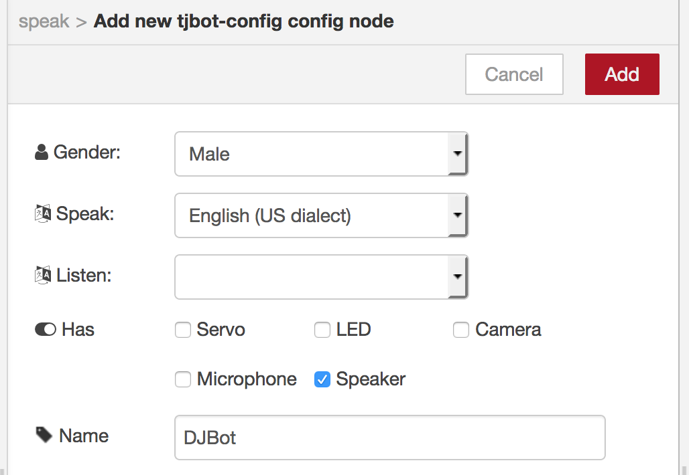
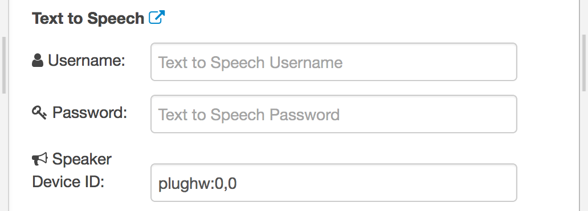

## Running the DJBot

You'll need to authorize Spotify to access your account. Open a browser and point it to the endpoint `/spotify/authorize`. This endpoint will redirect the browser to an authorization page that will request application access to the Spotify API.


Access the DJBot interface by opening the endpoint `/ui` of the Node-RED dashboard. Enter a song title and click on Search. If a song is found, the cover art will be displayed. The TJBot will be sent a command with the corresponding URL to the song.

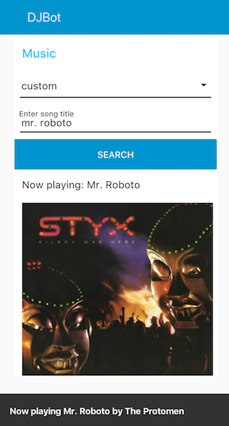

## License

This code is licensed under Apache 2.0. Full license text is available in [LICENSE](LICENSE).